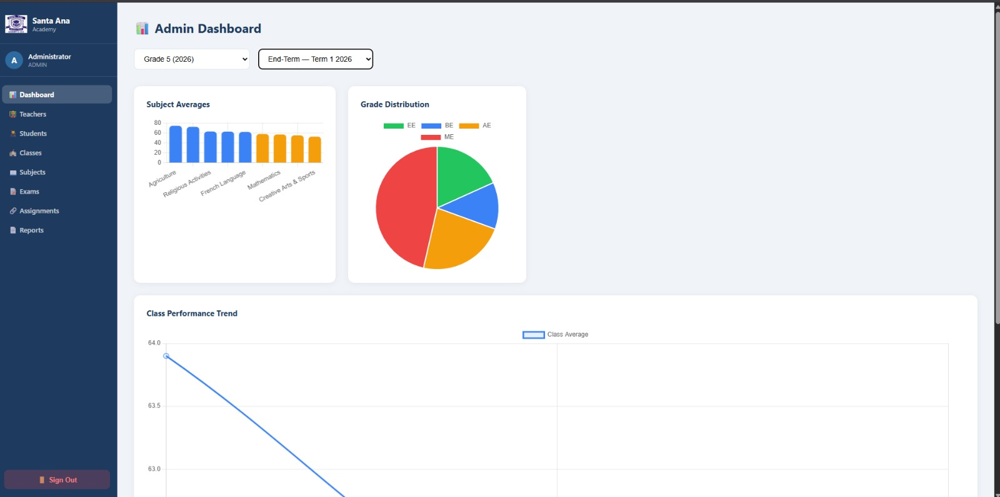
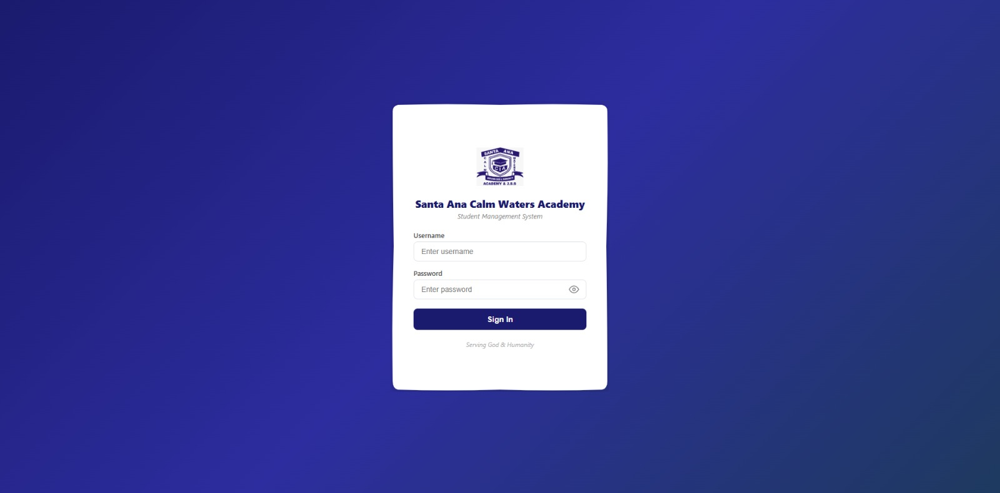

# School-Marks-System

A full-stack school management system built for **Santa Ana Calm Waters Academy**, currently in production serving real users. The system handles student records, marks entry, exam management, class organization, teacher assignments, PDF report card generation, and admin analytics.

**Live:** [school-marks-system-mauve.vercel.app](https://school-marks-system-mauve.vercel.app)




## Tech Stack

**Backend:** Java 21, Spring Boot 3, Spring Security, JPA/Hibernate, PostgreSQL  
**Frontend:** React, Vite, Recharts, Axios  
**Auth:** JWT-based authentication with role-based access (Admin, Teacher)  
**Deployment:** Railway (backend + database), Vercel (frontend)

## Features

- **Admin Dashboard** — Subject averages, grade distribution charts, class performance trends
- **Marks Entry** — Teachers enter marks per subject, exam, and class with validation
- **PDF Report Cards** — Single-student and batch download, dynamic margin computation, one student per A4 page
- **Student Management** — Full CRUD, activate/deactivate, class assignment
- **Teacher Management** — Subject-teacher assignments, role-based access control
- **Exam Management** — Create exams per term, link to classes and subjects
- **Class Organization** — Grade levels with multiple streams
- **Audit Logging** — Track administrative actions

## Architecture

```
┌──────────────┐     ┌──────────────────┐     ┌────────────┐
│   React UI   │────▶│  Spring Boot API  │────▶│ PostgreSQL │
│   (Vercel)   │◀────│    (Railway)      │◀────│ (Railway)  │
└──────────────┘     └──────────────────┘     └────────────┘
                            │
                     JWT Authentication
                     Role-Based Access
                     HikariCP Connection Pool
```

## Performance Optimizations

- HikariCP connection pool (max 15, min-idle 5) with leak detection
- 9 database performance indexes on frequently queried columns
- Hibernate batch fetching (batch size 16) and ordered inserts/updates
- Response compression for JSON, HTML, CSS, and JavaScript
- Open-in-view disabled to prevent lazy loading issues

## Running Locally

1. Clone the repository
2. Copy `.env.example` to `.env` and fill in your database credentials
3. Backend:
   ```bash
   cd school-marks-backend
   mvn spring-boot:run
   ```
4. Frontend:
   ```bash
   cd school-marks-frontend
   npm install
   npm run dev
   ```

## Environment Variables

See `.env.example` for required configuration. The application reads all sensitive values from environment variables — no credentials are stored in the codebase.

## License

This project is proprietary software built for Santa Ana Calm Waters Academy.
